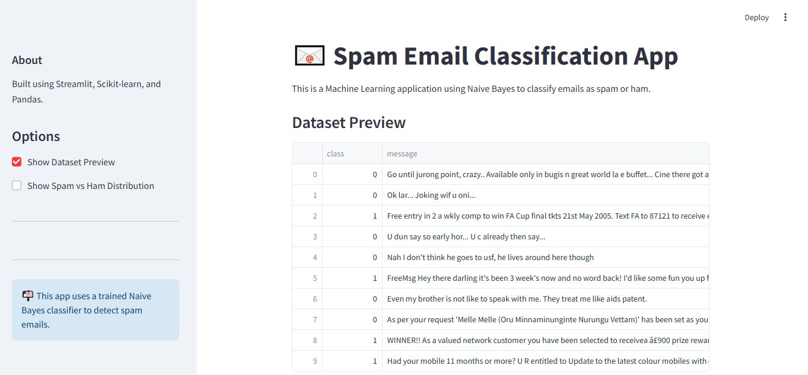

# 📧 Spam Email Classification App
## 🚀 Overview
The Email Spam Classification App is a machine learning project designed to classify emails as Spam or Ham (Not Spam) using a Naive Bayes Classifier. Built with Streamlit, the app provides a simple and interactive interface for users to input email content and receive instant classification results.

## ✨ Features
- 🌟 **Real-time Spam Detection**: Classifies emails as spam or ham instantly.
- 📊 **Visualization**: Displays a bar plot showing the distribution of spam vs ham emails.
- 📄 **Dataset Preview**: Offers a quick look at the raw dataset used for training.
- 🎨 **Interactive UI** — Built with Streamlit for a smooth user experience.

## 🧪 Dataset
The app uses a Spam/Ham Dataset (spam.csv), which contains labeled email data:
- ham — Non-spam emails (label = 0)
- spam — Spam emails (label = 1)
The preprocessing steps include:
- Dropping unnecessary columns
- Converting labels (ham/spam) to numeric values (0/1)
  
## ⚡ Model Used
- Naive Bayes Classifier (from Scikit-learn)
- The trained model (spam.pkl) and vectorizer (vectorizer.pkl) are loaded using pickle.

## 🏗️ Project Structure
```
📁 EMAIL-SPAM-DETECTION
│-- 📊 spam.csv                  # Dataset used for training and testing
│-- 📦 spam.pkl                  # Trained Naive Bayes model
│-- 📦 vectorizer.pkl            # Fitted CountVectorizer for text transformation
│-- 🏃 spamDetector.py           # Streamlit app for email classification
│-- 📓 email-spamDetector.ipynb # Jupyter notebook for model training and evaluation
│-- 📜 requirements.txt          # List of required libraries for the project
│-- 📄 README.md                 # Project documentation and usage instructions
```
## 🚀 Technologies Used
- Python
- Streamlit
- Scikit-learn
- Pandas
- Matplotlib & Seaborn (for visualization)
## 🏷️ How to Use the App
- Input email text in the text area under Email Classification.
- Click on the **Classify** button.
- The app will display whether the email is Spam or Ham.
- Use the sidebar to view the dataset and plot the spam vs ham distribution.
## 🔍 Sample Predictions
Here are a few examples of how the app classifies emails:
| Email Text                                              | Prediction |
|---------------------------------------------------------|------------|
| "Congratulations! You've won a $1000 Walmart gift card" | Spam       |
| "Meeting rescheduled to 3 PM tomorrow."                 | Ham        |
| "Click here to claim your free cruise!"                 | Spam       |
| "Please find attached the report for this week."        | Ham        |
## 🖼️ App Preview

### 📨 Email Classification Output


### 📊 Spam vs Ham Distribution


### 🗃️ Dataset Preview

 ## 🤝 Contributing
Feel free to fork the project, create feature branches, and submit pull requests.
